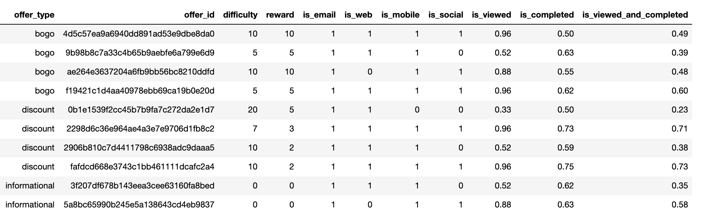
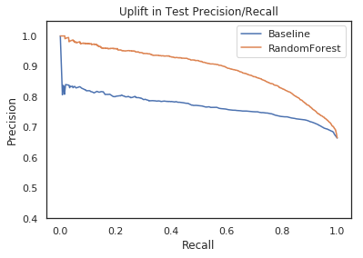

# Udacity Data Scientist Nanodegree - Starbucks Capstone Challenge

This repository houses the analysis on Udacity's Starbucks capstone project.

In this analysis, we will analyze the offers, transaction and profile demographics that were a part of Starbucks' marketing campaign (simulated). 

The goal of this notebook is to identify a way to better make decision on whether someone should be a target of a particular marketing offer. An ideal candidate should both `view` and `complete` the offer once it has been sent. 

Medium post for this analysis: 

https://medium.com/@aldistefanusfelim/who-will-buy-more-coffee-an-analysis-of-starbucks-promotional-offers-fa14077a7e6d

# 1. Introduction

This data set contains simulated data that mimics customer behavior on the Starbucks rewards mobile app. Once every few days, Starbucks sends out an offer to users of the mobile app. An offer can be merely an advertisement for a drink or an actual offer such as a discount or BOGO (buy one get one free). Some users might not receive any offer during certain weeks. 

Not all users receive the same offer, and that is the challenge to solve with this data set.

Your task is to combine transaction, demographic and offer data to determine which demographic groups respond best to which offer type. This data set is a simplified version of the real Starbucks app because the underlying simulator only has one product whereas Starbucks actually sells dozens of products.

Every offer has a validity period before the offer expires. As an example, a BOGO offer might be valid for only 5 days. You'll see in the data set that informational offers have a validity period even though these ads are merely providing information about a product; for example, if an informational offer has 7 days of validity, you can assume the customer is feeling the influence of the offer for 7 days after receiving the advertisement.

You'll be given transactional data showing user purchases made on the app including the timestamp of purchase and the amount of money spent on a purchase. This transactional data also has a record for each offer that a user receives as well as a record for when a user actually views the offer. There are also records for when a user completes an offer. 

Keep in mind as well that someone using the app might make a purchase through the app without having received an offer or seen an offer.

# 2. Data Sets

The folder /data contains three files

* portfolio.json - containing offer ids and meta data about each offer (duration, type, etc.)
* profile.json - demographic data for each customer
* transcript.json - records for transactions, offers received, offers viewed, and offers completed

Here is the schema and explanation of each variable in the files:

**portfolio.json**
* id (string) - offer id
* offer_type (string) - type of offer ie BOGO, discount, informational
* difficulty (int) - minimum required spend to complete an offer
* reward (int) - reward given for completing an offer
* duration (int) - time for offer to be open, in days
* channels (list of strings)

**profile.json**
* age (int) - age of the customer 
* became_member_on (int) - date when customer created an app account
* gender (str) - gender of the customer (note some entries contain 'O' for other rather than M or F)
* id (str) - customer id
* income (float) - customer's income

**transcript.json**
* event (str) - record description (ie transaction, offer received, offer viewed, etc.)
* person (str) - customer id
* time (int) - time in hours since start of test. The data begins at time t=0
* value - (dict of strings) - either an offer id or transaction amount depending on the record

# 3. Dependencies

You will need the following python packages to run this notebook:

- numpy 
- pandas
- sklearn 
- matplotlib
- seaborn

# 4. Results and Conclusion

1. Whether or not a particular offer will be viewed by the recipient depends far more heavily on the distribution channel that was used. This was concluded when offers disseminated to similar demographic target groups while having different distribution channel turned out to have a wide gap in the view rate. Social media channels are particularly very important, as we are seeing the view rate suffer for offers that were not distributed via social media channel.

2. Two models are produced in this analysis: 
    - Simpler, baseline model that only takes into account the target's demographic features (Gender, Income and Age) to produce the probability that the person will complete the particular offer. Threshold were chosen by optimizing for f1-score. At the highest f1-score combination, the model has a 69% precision and 98% recall. 
    
    - A Random Forest classifier leveraging more features including transacted amounts and tenure. The model has an average improvement of around 10% in precision, yet this improvement diminishes at very high recall rates. 
    
    

    
Choosing between these two models will depend on whether the best marketing strategy is best obtained through maximizing recall or whether the perceived cost of sending a wasted offer is deemed as too high so that a higher precision is needed. 

If maximizing recall is the strategy, the first simpler, baseline model will do just fine, and will have an added benefit of faster training & inference time. However, if higher precision is needed, then Random Forest model is preferred.

As both models outputs the probability, a threshold needs to be chosen as well. Again, this threshold depends on the precision/recall trade-off, and can be evaluated better to maximize the dollar gain of the campaign. As such information is not available for this analysis, the threshold is chosen by maximizing the f1-score instead.

# 5. Acknowledgments
1. Udacity - for designing the course and the project
2. Starbucks - for providing the dataset and project opportunity
